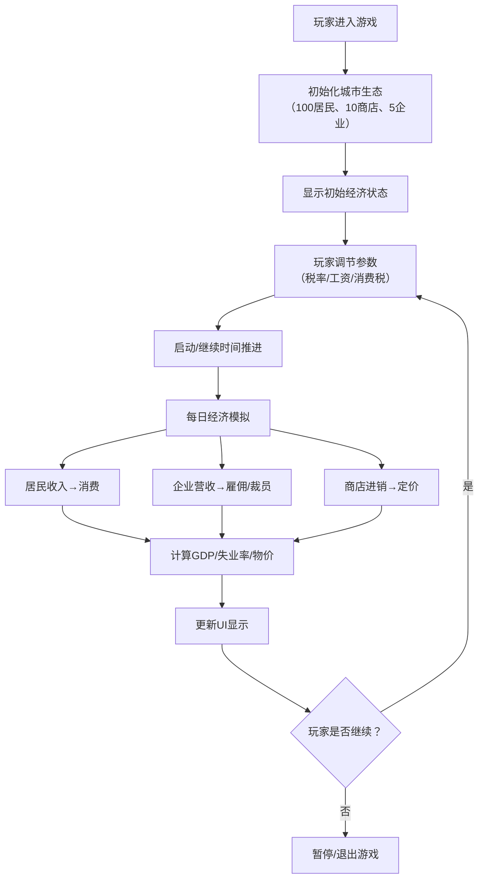

## 1. 产品概述

《经济生态箱》是一款城市经济模拟小游戏，玩家通过调节关键经济参数，观察城市中居民、商店、企业三大实体的互动变化，理解经济运行的基本规律。

- 核心玩法：调节税率、工资、消费税三大参数，观察GDP、失业率、物价指数的实时变化
- 目标用户：对经济模拟感兴趣的休闲玩家，以及需要直观理解经济概念的学习者
- 产品价值：将抽象的经济概念具象化，通过互动式游戏体验传递经济学常识

## 2. 核心功能

### 2.1 用户角色

| 角色 | 注册方式 | 核心权限 |
|------|----------|----------|
| 玩家 | 无需注册，直接进入游戏 | 调节经济参数、观察城市运行、控制时间推进 |

### 2.2 功能模块

1. **主游戏页面**：城市可视化展示、实体动态变化、经济指标面板、参数控制面板
2. **时间控制系统**：自动/手动推进游戏天数，控制游戏速度
3. **经济模拟引擎**：基于简单规则的经济模型，计算每日经济变化

### 2.3 页面详情

| 页面名称 | 模块名称 | 功能描述 |
|----------|----------|----------|
| 主游戏页面 | 城市可视化区 | 以图形化方式展示城市中的居民、商店、企业，动态反映经营状态 |
| 主游戏页面 | 经济指标面板 | 实时显示GDP、失业率、物价指数三大核心指标及变化趋势 |
| 主游戏页面 | 参数控制面板 | 提供税率、最低工资、消费税三个滑块，支持实时调节 |
| 主游戏页面 | 时间控制区 | 显示当前天数，提供暂停/播放、速度调节功能 |
| 主游戏页面 | 实体详情区 | 点击实体可查看详细信息（居民收入/消费、企业营收/员工等） |

## 3. 核心流程

### 经济模拟规则

1. **居民行为**：
   - 有工作的居民每月获得工资收入
   - 收入扣除税金后用于消费（消费倾向=80%）
   - 消费按比例分配到各商店
   - 失业居民无收入，消耗储蓄

2. **企业行为**：
   - 雇佣工人生产产品
   - 支付工资和缴纳税金
   - 营收连续3天下降则裁员
   - 营收连续7天增长则扩招

3. **商店行为**：
   - 从企业进货，加价销售给居民
   - 根据销量调整进货量
   - 根据供需关系调整售价（影响物价指数）

4. **政府行为**：
   - 征收个人所得税（按税率）
   - 征收企业营业税（按税率）
   - 征收消费税（按消费额比例）
   - 税收用于支付失业救济金

## 4. 用户界面设计

### 4.1 设计风格

**设计方向：复古像素风 + 现代扁平化**

- **主色调**：深青色（#1a3a4a）作为背景，搭配暖橙色（#ff9500）作为强调色
- **辅助色**：薄荷绿（#34c759）表示增长/正向，珊瑚红（#ff3b30）表示下降/负向
- **字体**：标题使用 "Press Start 2P" 像素风格字体，正文使用 "VT323" 复古终端字体
- **布局风格**：卡片式布局，清晰的功能分区，像素边框装饰
- **图标风格**：像素风emoji和简约图标，保持复古游戏感

### 4.2 页面设计概览

| 页面名称 | 模块名称 | UI元素 |
|----------|----------|--------|
| 主游戏页面 | 城市可视化区 | 网格布局展示城市建筑，不同颜色代表不同实体类型，悬停显示状态 |
| 主游戏页面 | 经济指标面板 | 三个大型数字卡片，带有趋势箭头和日变化百分比，背景有微妙的像素纹理 |
| 主游戏页面 | 参数控制面板 | 三个横向滑块，带有当前值和默认值标记，滑块拖动时有实时反馈 |
| 主游戏页面 | 时间控制区 | 像素风格按钮组：◀❚❚▶，天数显示为大号数字 |
| 主游戏页面 | 实体详情区 | 侧边滑出面板，显示选中实体的详细数据和历史变化 |

### 4.3 响应式设计

- **桌面端优先**：1280px及以上为最佳体验，城市区域占据主要屏幕空间
- **平板适配**：1024px-1279px，指标面板和控制面板改为上下布局
- **移动端适配**：768px-1023px，城市区域缩放，控制面板折叠为可展开面板
- **触控优化**：滑块增加触控区域，按钮最小尺寸44×44px

### 4.4 动画与交互

- **页面加载**：城市建筑从下至上逐个浮现，带有像素跳动效果
- **参数调节**：拖动滑块时，相关指标数字实时预览变化，颜色渐变提示
- **时间推进**：每天切换时有轻微的翻页效果，数字滚动更新
- **实体状态变化**：企业裁员时显示红色闪烁，新店开张时显示绿色粒子效果
- **趋势变化**：指标箭头带有呼吸动画，增长/下降趋势一目了然

