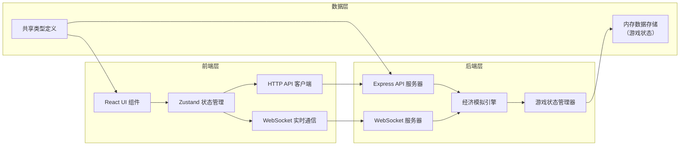
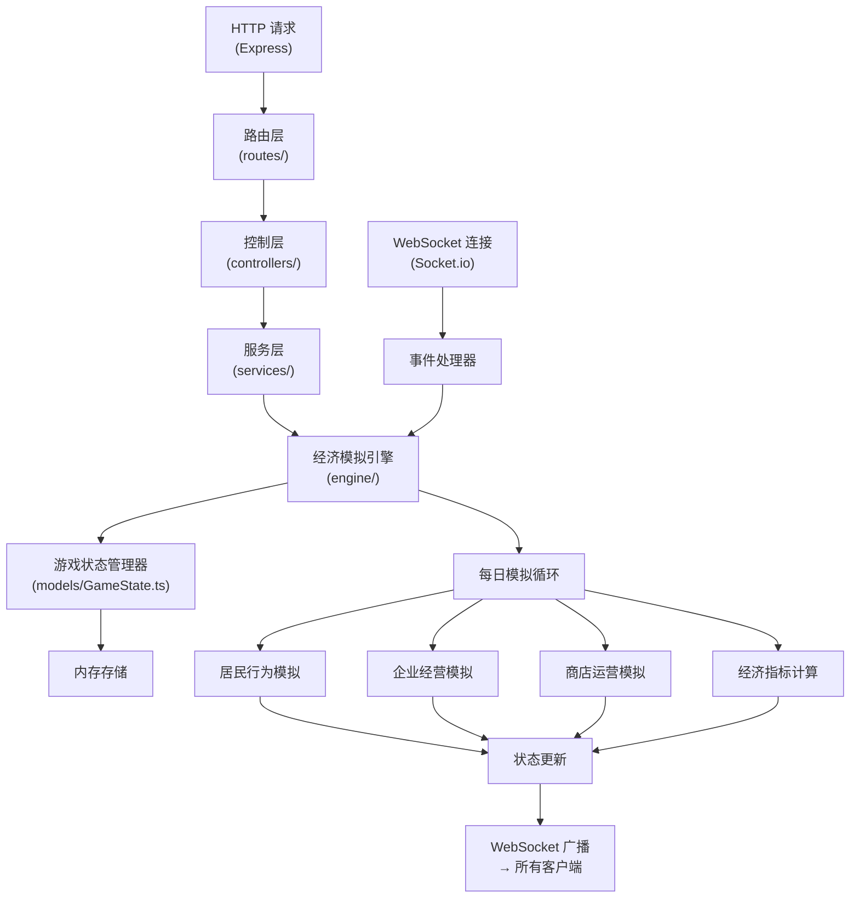
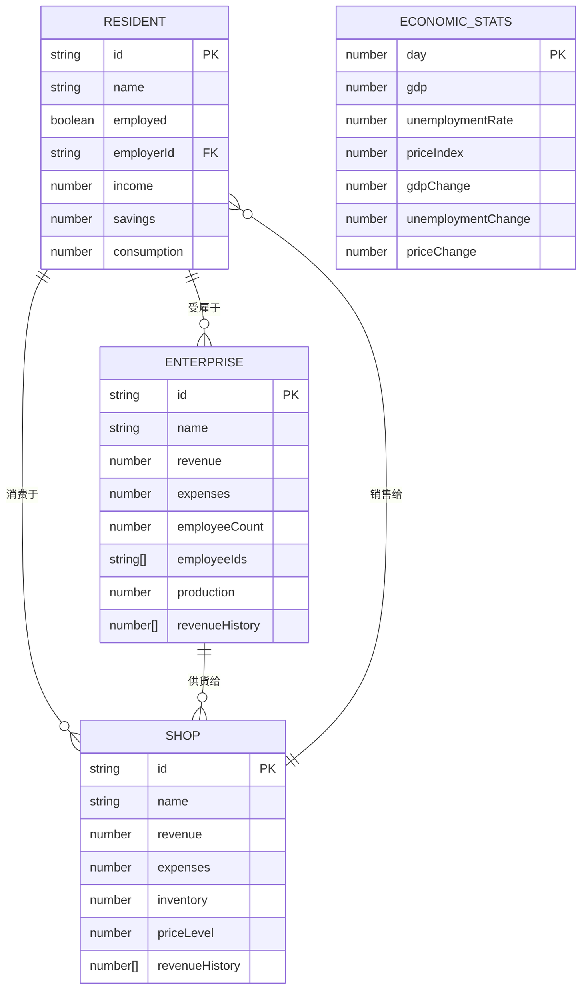

## 1. 架构设计



## 2. 技术描述

### 技术栈选择
- **前端框架**：React 18 + TypeScript 5
- **构建工具**：Vite 5
- **状态管理**：Zustand 4
- **样式方案**：TailwindCSS 3
- **图标库**：Lucide React
- **后端框架**：Express 4 + TypeScript
- **实时通信**：Socket.io（WebSocket）
- **HTTP 客户端**：Axios
- **项目模板**：react-express-ts（前后端分离）

### 目录结构
```
├── src/                    # 前端代码
│   ├── components/         # React 组件
│   │   ├── CityView/       # 城市可视化组件
│   │   ├── ControlPanel/   # 参数控制面板
│   │   ├── StatsPanel/     # 经济指标面板
│   │   ├── TimeControl/    # 时间控制组件
│   │   └── EntityDetail/   # 实体详情组件
│   ├── hooks/              # 自定义 Hooks
│   ├── store/              # Zustand 状态管理
│   ├── utils/              # 工具函数
│   ├── types/              # 类型定义
│   ├── App.tsx
│   └── main.tsx
├── api/                    # 后端代码
│   ├── controllers/        # API 控制器
│   ├── services/           # 业务逻辑
│   ├── engine/             # 经济模拟引擎
│   ├── models/             # 数据模型
│   ├── routes/             # 路由定义
│   ├── types/              # 类型定义
│   └── index.ts
├── shared/                 # 前后端共享类型
│   └── index.ts
├── vite.config.ts
├── tailwind.config.js
└── package.json
```

## 3. 路由定义

### 前端路由
| 路由 | 页面 | 说明 |
|------|------|------|
| / | 主游戏页面 | 游戏主界面，包含城市视图、控制面板、指标面板 |

### 后端 API 路由
| 方法 | 路由 | 用途 |
|------|------|------|
| GET | /api/game/state | 获取当前游戏状态 |
| POST | /api/game/init | 初始化新游戏 |
| POST | /api/game/reset | 重置游戏 |
| POST | /api/game/params | 更新经济参数（税率、工资、消费税） |
| POST | /api/game/step | 手动推进一天 |
| GET | /api/game/entity/:id | 获取指定实体详情 |
| GET | /api/game/history | 获取历史经济数据 |

### WebSocket 事件
| 事件名 | 方向 | 用途 |
|--------|------|------|
| game:state | 服务端→客户端 | 推送最新游戏状态 |
| game:params:update | 客户端→服务端 | 更新参数 |
| game:control | 客户端→服务端 | 控制游戏（暂停/播放/速度） |

## 4. API 定义

### 类型定义

```typescript
// shared/index.ts

// 经济参数
export interface EconomicParams {
  taxRate: number;           // 税率 0-0.5
  minimumWage: number;       // 最低工资 1000-5000
  consumptionTax: number;    // 消费税 0-0.3
}

// 实体类型
export type EntityType = 'resident' | 'shop' | 'enterprise';

// 居民
export interface Resident {
  id: string;
  type: 'resident';
  name: string;
  employed: boolean;
  employerId: string | null;
  income: number;
  savings: number;
  consumption: number;
  position: { x: number; y: number };
}

// 商店
export interface Shop {
  id: string;
  type: 'shop';
  name: string;
  revenue: number;
  expenses: number;
  inventory: number;
  priceLevel: number;
  position: { x: number; y: number };
  revenueHistory: number[];
}

// 企业
export interface Enterprise {
  id: string;
  type: 'enterprise';
  name: string;
  revenue: number;
  expenses: number;
  employeeCount: number;
  employeeIds: string[];
  production: number;
  position: { x: number; y: number };
  revenueHistory: number[];
}

export type Entity = Resident | Shop | Enterprise;

// 经济指标
export interface EconomicStats {
  gdp: number;
  gdpChange: number;         // 日变化百分比
  unemploymentRate: number;
  unemploymentChange: number;
  priceIndex: number;
  priceChange: number;
  totalPopulation: number;
  employedPopulation: number;
}

// 游戏状态
export interface GameState {
  day: number;
  isRunning: boolean;
  speed: number;             // 1-3
  params: EconomicParams;
  stats: EconomicStats;
  entities: Entity[];
  history: EconomicStats[];
}

// API 响应
export interface ApiResponse<T> {
  success: boolean;
  data: T;
  message?: string;
}
```

### 请求/响应示例

#### GET /api/game/state
响应：
```json
{
  "success": true,
  "data": {
    "day": 1,
    "isRunning": false,
    "speed": 1,
    "params": {
      "taxRate": 0.2,
      "minimumWage": 2000,
      "consumptionTax": 0.1
    },
    "stats": {
      "gdp": 500000,
      "gdpChange": 0,
      "unemploymentRate": 0.05,
      "unemploymentChange": 0,
      "priceIndex": 100,
      "priceChange": 0,
      "totalPopulation": 100,
      "employedPopulation": 95
    },
    "entities": [...],
    "history": []
  }
}
```

#### POST /api/game/params
请求：
```json
{
  "taxRate": 0.25,
  "minimumWage": 2500,
  "consumptionTax": 0.12
}
```
响应：
```json
{
  "success": true,
  "data": {
    "taxRate": 0.25,
    "minimumWage": 2500,
    "consumptionTax": 0.12
  }
}
```

## 5. 服务器架构



### 分层职责
- **路由层**：定义 API 端点和 WebSocket 事件
- **控制层**：处理请求参数验证和响应格式化
- **服务层**：封装核心业务逻辑
- **引擎层**：经济模拟核心算法
- **模型层**：数据结构和状态管理

## 6. 数据模型

### 6.1 实体关系图



### 6.2 经济模拟引擎核心算法

```typescript
// 每日模拟流程
function simulateDay(state: GameState): GameState {
  const newState = deepClone(state);
  newState.day += 1;
  
  // 1. 企业发放工资
  simulateWagePayment(newState);
  
  // 2. 居民消费
  simulateConsumption(newState);
  
  // 3. 企业生产
  simulateProduction(newState);
  
  // 4. 企业雇佣决策
  simulateHiringDecisions(newState);
  
  // 5. 商店进销存
  simulateShopOperations(newState);
  
  // 6. 计算税收
  simulateTaxCollection(newState);
  
  // 7. 计算经济指标
  calculateEconomicStats(newState);
  
  // 8. 记录历史数据
  newState.history.push({ ...newState.stats });
  
  return newState;
}

// 居民消费计算
function simulateConsumption(state: GameState): void {
  const { params, entities } = state;
  const residents = entities.filter(e => e.type === 'resident') as Resident[];
  const shops = entities.filter(e => e.type === 'shop') as Shop[];
  
  residents.forEach(resident => {
    if (resident.employed) {
      const disposableIncome = resident.income * (1 - params.taxRate);
      const consumptionAmount = disposableIncome * 0.8 * (1 - params.consumptionTax);
      resident.consumption = consumptionAmount;
      resident.savings += disposableIncome - consumptionAmount;
      
      // 按商店规模分配消费
      const totalShopRevenue = shops.reduce((sum, s) => sum + s.revenue, 0) || 1;
      shops.forEach(shop => {
        const shopShare = shop.revenue / totalShopRevenue;
        const consumptionForShop = consumptionAmount * shopShare;
        shop.revenue += consumptionForShop * (1 + params.consumptionTax);
      });
    } else {
      // 失业人员消耗储蓄
      const consumptionAmount = Math.min(resident.savings * 0.5, 500);
      resident.consumption = consumptionAmount;
      resident.savings -= consumptionAmount;
    }
  });
}

// 企业雇佣决策
function simulateHiringDecisions(state: GameState): void {
  const enterprises = state.entities.filter(e => e.type === 'enterprise') as Enterprise[];
  const unemployedResidents = state.entities.filter(
    e => e.type === 'resident' && !e.employed
  ) as Resident[];
  
  enterprises.forEach(enterprise => {
    const history = enterprise.revenueHistory;
    if (history.length >= 3) {
      const isDeclining = history.slice(-3).every((val, i, arr) => 
        i === 0 || val < arr[i - 1]
      );
      
      if (isDeclining && enterprise.employeeCount > 1) {
        // 裁员
        const laidOffId = enterprise.employeeIds.pop()!;
        const resident = state.entities.find(e => e.id === laidOffId) as Resident;
        if (resident) {
          resident.employed = false;
          resident.employerId = null;
          resident.income = 0;
        }
        enterprise.employeeCount--;
        enterprise.expenses -= state.params.minimumWage;
      }
    }
    
    if (history.length >= 7) {
      const isGrowing = history.slice(-7).every((val, i, arr) => 
        i === 0 || val > arr[i - 1]
      );
      
      if (isGrowing && unemployedResidents.length > 0) {
        // 扩招
        const newHire = unemployedResidents.shift()!;
        newHire.employed = true;
        newHire.employerId = enterprise.id;
        newHire.income = state.params.minimumWage;
        enterprise.employeeIds.push(newHire.id);
        enterprise.employeeCount++;
        enterprise.expenses += state.params.minimumWage;
      }
    }
  });
}

// 经济指标计算
function calculateEconomicStats(state: GameState): void {
  const { entities, params } = state;
  const residents = entities.filter(e => e.type === 'resident') as Resident[];
  const shops = entities.filter(e => e.type === 'shop') as Shop[];
  const enterprises = entities.filter(e => e.type === 'enterprise') as Enterprise[];
  
  // GDP = 居民消费 + 企业生产 + 政府支出
  const totalConsumption = residents.reduce((sum, r) => sum + r.consumption, 0);
  const totalProduction = enterprises.reduce((sum, e) => sum + e.production, 0);
  const governmentSpending = residents.filter(r => !r.employed).length * 500;
  const gdp = totalConsumption + totalProduction + governmentSpending;
  
  // 失业率
  const unemployed = residents.filter(r => !r.employed).length;
  const unemploymentRate = unemployed / residents.length;
  
  // 物价指数（以第1天为100基准）
  const avgPrice = shops.reduce((sum, s) => sum + s.priceLevel, 0) / shops.length;
  const basePrice = state.history[0] ? state.history[0].priceIndex / 100 * 1 : 1;
  const priceIndex = (avgPrice / basePrice) * 100;
  
  // 计算变化率
  const prevStats = state.history[state.history.length - 1];
  const gdpChange = prevStats ? ((gdp - prevStats.gdp) / prevStats.gdp) * 100 : 0;
  const unemploymentChange = prevStats ? (unemploymentRate - prevStats.unemploymentRate) * 100 : 0;
  const priceChange = prevStats ? ((priceIndex - prevStats.priceIndex) / prevStats.priceIndex) * 100 : 0;
  
  state.stats = {
    gdp,
    gdpChange,
    unemploymentRate,
    unemploymentChange,
    priceIndex,
    priceChange,
    totalPopulation: residents.length,
    employedPopulation: residents.filter(r => r.employed).length,
  };
}
```
